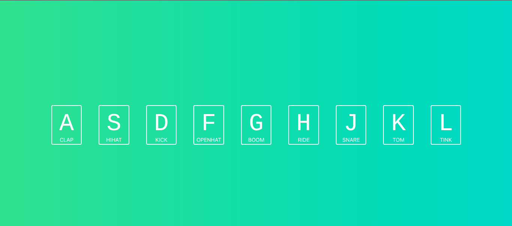

# Drum-Kit

## Live Version : [See here](https://sauravchamoli17.github.io/Drum-Kit/)

> The point of this project is to have each key, when pressed, make a corresponding drum noise. It also uses CSS transitions and animations to make the project more interactive to the user.
